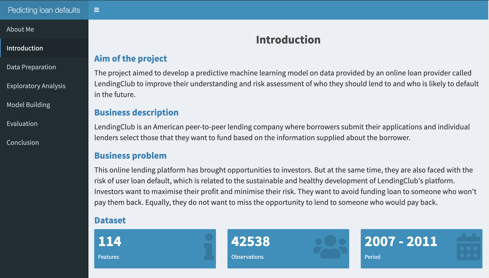
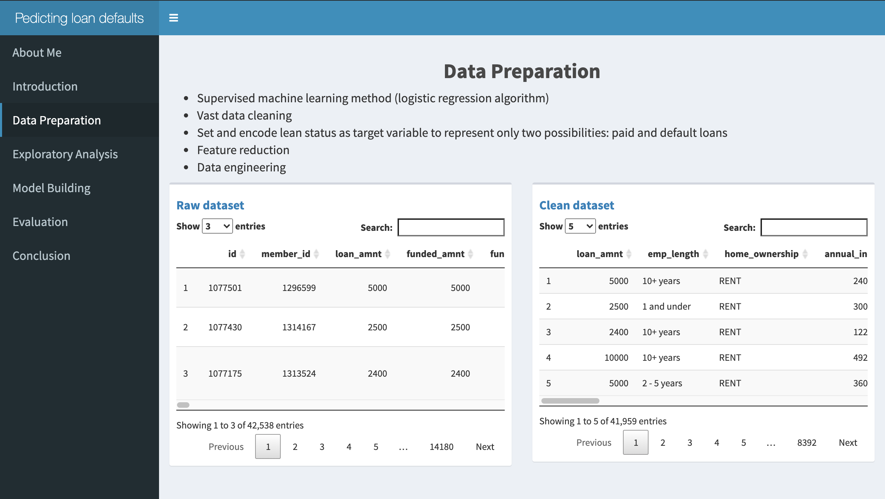
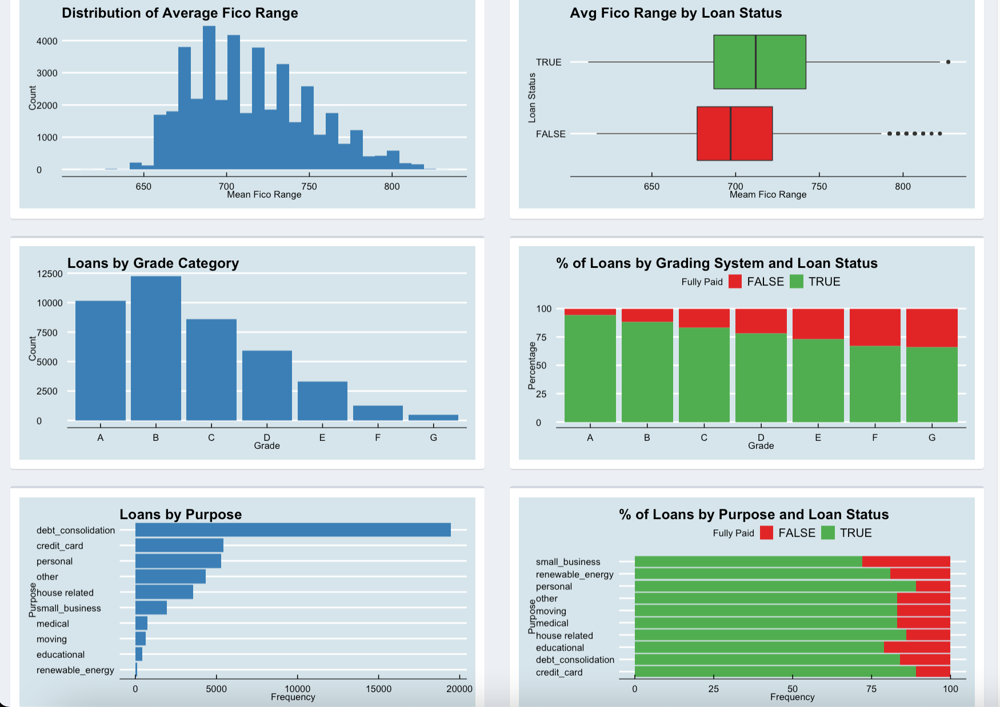
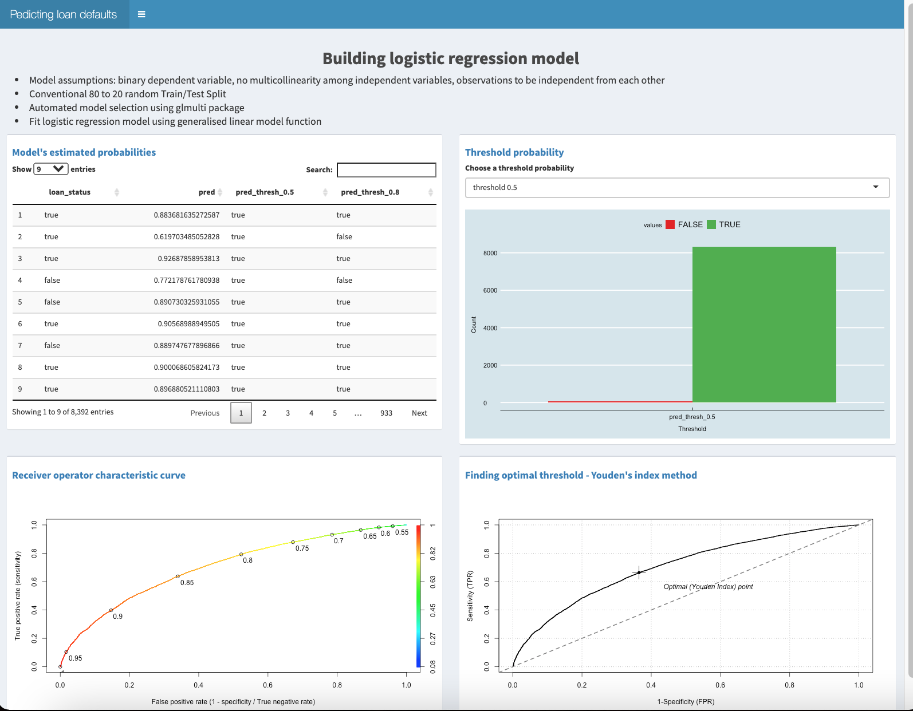
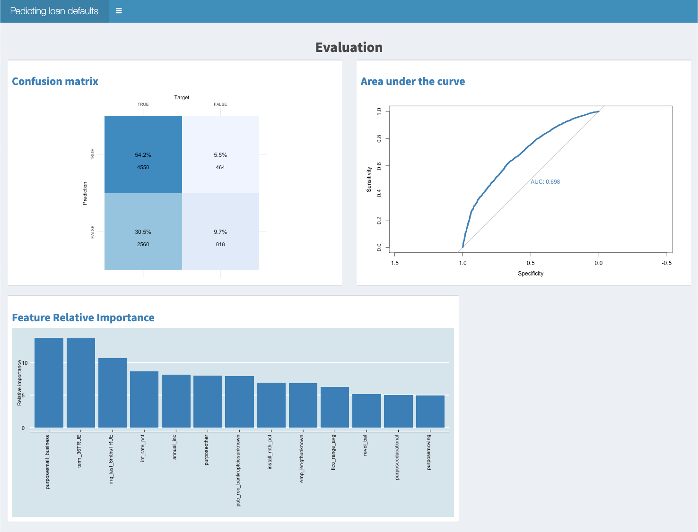
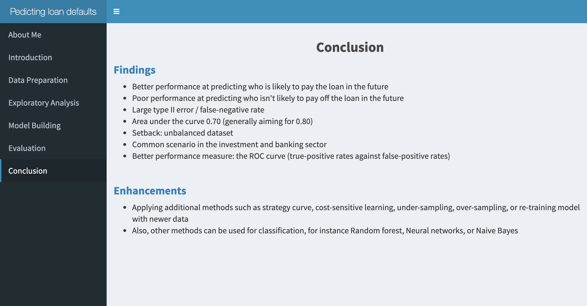

# Predicting Loan Defaults

| Author                                 | Date        |
| -----------                           | ----------- |
| Karolina Frieszova| 2021-03-24  |

- For comprehensive analysis and code please look at the file called complete\_case_analysis.pdf in the scripts folder.

- The whole project was written in R.

- Screenshots of the presented dashboard about the project findings are attached below. 

### INTRODUCTION

**The project aimed** to develop a predictive machine learning model on data provided by an online loan provider called LendingClub to aid their understanding and risk assessment of who they should lend to and who is likely to default in the future. 

A little bit **about the business**. LendingClub is an American peer-to-peer lending company where borrowers submit their applications and individual lenders select those that they want to fund based on the information provided about the borrower.

So what is the **business problem** that we are trying to solve? The online lending platform has brought opportunities to in
vestors. But at the same time, they are faced with the risk of user loan default, which is related to the sustainable and healthy development of the platform. Investors want to avoid funding loans to someone who won’t pay them back. Equally, they do not want to miss the opportunity to lend to someone who would pay back.

So my project was basically about finding the right characteristics of an applicant and establishing an optimal threshold of accepted applications to maximise the profit of the business.

**About the dataset**, I was working with. It contains information about all loans, both past, and current, provided by LendingCub in 5 years, from 2007 to 2011. Each row represents one borrower and his or her information. Just above 42500 loans with information such as loan amount, installment, annual income, title, postcode, and much more.

### DATA PREPARATION

To build a predictive model, I used a supervised machine learning method, specifically, a logistic regression. But before I could start building my binary classifier, I had to curry out vast data cleaning.

I set loan status as my **target variable** and reduced the number of observations by selecting only past loans as these have known outcomes. I encoded it to represent only two possibilities: paid and default loans. 

Further, the dataset contains **114 different columns** that LendingClub collects during different stages of the loan process. As the project goal was to build a model that works with data that the company holds on applicants before the decision has been made about whether to grant the applicant loan. Therefore, I dropped variables containing information that are not present during the initial stage. 

I then **engineered some of the features** to for instance tackle features with high cardinality, drop highly correlated features, dealt with missing values and create feature monthly salary expense. 

At the bottom of the page,  we can see the original dataset on the left-hand side and on the right side a clean data set with 21 independent variables plus one target variable. As a result of data cleaning, the dataset was reduced by approximately 500 rows to still almost 42000 in total.

### EXPLORATORY ANALYSIS

After that, I performed an exploratory analysis to familiarise myself with the data and I look for any obvious predictors. 
I analysed loan amount, interest rate, credit score, loan grading, purpose, homeownership, and verification status. 

I identified for instance that default loans tend to have much higher interest rates and a much smaller Fico Range which is equivalent to the UK’s credit score. Further, I calculated the percentage of each loan grading per loan status. I could see that the proportion of loans that are not fully paid increases with poorer risk grading. Finally, I looked at the distribution of loans by purpose. I could see that to take a loan for a small business and education had the highest percentage of default loans, however, there weren’t overall so many loans taken for this purposes.

### MODEL BUILDING

Next step, I got to building my **logistic regression model**. After I assured that my features fulfill the **model assumptions** on the independence of two variables, dependent variable to be binary, and no high correlation between independent variables. 

I split my data into a **training set and testing set** using a conventional 80 to 20 random split. It assured that my outcome variable is well-balanced in each piece so our test set is representative of our training set. It is important to address that I worked with an unbalanced dataset where the target variable was represented in an approximate ratio of 5 to 1, paid loans to default. This is understandably due to the nature of the business. 

At this stage, I used **automated model selection** to look for the best model and to further decrease the feature selection. It calculated a model with 11 predictors plus the outcome variable. 
Which I then fitted into the generalised linear model function for logistic regression.

As we know logistic regression has binary values for the dependent variable and the **model outputs estimated probabilities**. In the data table, we can see how the model uses these probability values. We have to set a threshold above which we say the loan application is predicted to be paid, and below which it’s predicted to be a default.

Selecting an optimal threshold value is often challenging. A receiver characteristic curve or **ROC curve** can help us decide which value of the threshold is the best. The ROC curve is shown on the down left side of the page. The sensitivity or true positive rate of the model is shown on the y axis, and the false positive rate or 1 minus the specificity is given on the x-axis. The line shows how these two outcome measures vary with different threshold values.  for example around the point(0.35, 0.65), we are correctly labeling about 65% of paid loans but have a false positive rate of 35%. 
The ROC curve captures all thresholds simultaneously. The higher the threshold or closer to point (0,0), the higher the specificity and lower the sensitivity. The lower the threshold of closer to point(1,1), the higher the sensitivity and lower the specificity. 
So which threshold value should we pick? We should select the best threshold for the tradeoff we want to make. 

By default, the threshold value is set to 0.5 which works well for balanced datasets. But in my case, I worked with an unbalanced dataset where most of the clients fell into class one paid loan. We could try to address this issue by finding an optimal threshold. On the right-hand side, you could see **Youden’s Index graph** which gives equal weight to false positive and false negative values, which means the same proportion of miscalculated results. Using this method, I calculated the threshold value as 0.85 which is pretty close to the disproportion of the target variable 5 to 1.

### EVALUATION

I have adjusted my classification model by applying the optimal **threshold** of 0.85 as a cut-off point where the model predicts a loan to be paid by the borrower and we can accept the application, and below which model predicts that the borrower is likely to default and application could be declined by the business.

On the left side, is my final **confusion matrix** converted to a percentage and visualised as a heat map. As you can see the logistic regression model is better at predicting who will pay the loan but or true positive at 54%. On the other hand, the model is very poor at predicting the defaults with true negative coming to under 10%.
The model has a large type II error, false negative when the model predicts loan to be default but it is actually paid off.

Next, we could calculate the area under the curve or **AUC**. We could use this as another measure of performance. The matrics ranges from 0.5 to 1, and values above 0.8 generally indicate that the model does a good job in describing between two categories which comprise our target variable. Our model has an accuracy of 70% which is definitely better than the random guess but we could look at how to improve it.

Below is a bar graph showing the **relative importance** of the main features that have a direct impact on an applicant being likely to pay the loan back or fall into default. The highest impact has a purpose of loan for small business, followed by loan term of 36 months, and loan inquiry in the past 6 months.

### CONCLUSION

I can conclude that my final model performs better when predicting who is likely to pay off the loan comparing to who isn't likely to pay back in the future. Additionally, the model produces a large type II error of false-negative rate which can lead to false assumptions and poor decision making that can result in lost sales or decreased profits. 

I also looked at the area under the curve (AUC) which is another measure of the model's performance. Where generally values above 0.80 indicate that the model does a good job in describing between two categories. Our model produced AUC on the test set equal to 0.70 which is better than a random guess but we should look at how we can improve it. 

The possible reason why our model is not great at predicting who won’t pay back could be due to learning from the unbalanced dataset. The model learned from the training set with a significantly higher proportion of fully paid compared to default loans. Therefore, default loan is a rare event in our training data set.

Dealing with disproportionate classification is a common scenario in the investment and banking sector, where the classification accuracy could be a problematic measure and could lead us to make wrong decisions. 

For future model performance improvement, I would suggest applying additional methods such as strategy curve, cost-sensitive learning, under-sampling, over-sampling, re-training model with newer data. 
Also, other methods can be used for classification, for instance, random forest, neural networks, or naive Bayes. 

